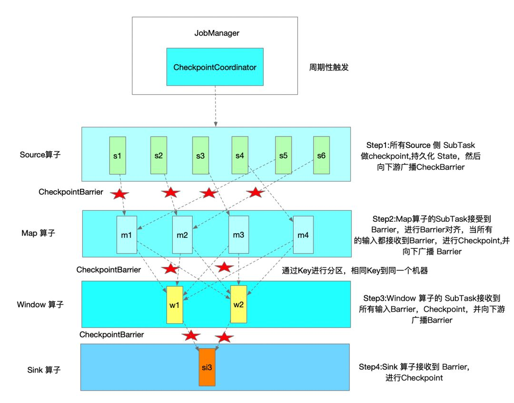

### 分布式快照

所谓分布式快照，就是在特定时间点记录下来的分布式系统的全局状态，这个全局状态既包含所有进程的状态也包括链路的状态，主要用于分布式系统的故障
恢复、死锁检测和垃圾收集等。由于链路本身只负责传递消息，其状态不容易被记录，所以很难在同一瞬间捕捉所有进程和链路的状态，而Chandy-Lamport
算法则通过每个进程记录与自己相关的状态，并最终合并出全局状态来达到了同样的效果。

该算法可以分成3个阶段，下面分别进行描述：
  * 初始化快照：快照发起进程记录自己的状态，并通过其所有的流出链路向其它进程发送特殊标记信息，同时通过所有流入链路监听流入信息;

  * 扩散快照：对于所有的进程(包括快照发起进程)，如果在其某个流入链路收到了特殊标记信息。如果该进程还没有记录过自己的状态，则记录自己的状态，
  并通过所有流出链路向其它进程发送特殊标记信息，通过所有流入链路监听流入信息；如果该进程已经记录过自己的状态，则记录流入链路上监听到的信息，
  直到收到特殊标记为止;

  * 完成快照：如果所有进程都收到了特殊标记信息，并记录下了自己的状态，也记录下了流入链路信息，表示快照已经成功完成。将这些状态传输到稳定的
  存储位置即可。

这就是Chandy-Lamport分布式快照的实现原理。

Flink以该算法为基础，实现了异步屏障快照(ABS)算法。简单的说，Flink的JobManager会周期性的向每个SourceTask发送一条包含一个新checkpointId
的消息，间隔时间由配置env.enableCheckpointing(间隔时间毫秒)控制，以初始化一个checkpoint。当SourceTask收到这条消息时就会停止向下游发送
消息，广播一种特殊的记录checkpoint barrier(作用类似于Chandy-Lamport算法中的特殊标记信息)，并在StateBackend生成一个包含本地状态的checkpoint。

CheckpointBarrier类有三个成员变量：
  * id：它与checkpointId对应，并保持严格递增，因此值越大表明checkpoint越新；如果是standalone模式则是原子变量，否则如果是HA模式则使用
  zookeeper分布式集群Curator的分布式整型int计数器SharedCount来确保跨JobManager的严格递增;

  * timestamp：记录checkpoint barrier产生的时间，ScheduledTrigger这个线程的run方法调用triggerCheckpoint触发checkpoint时传入的是
  系统当前的时间，并将其作为checkpoint的timestamp的值;

  * checkpointOptions：进行checkpoint操作时的选项，包括checkpoint的类型及保存位置的设置;

我们来看一下整个source端快照触发的过程，一个非常长的调用链...

CheckpointCoordinator类用于协调算子和状态的分布式快照的逻辑，其会启动一个定时器定时调用ScheduledTrigger的run()方法，这个run()方法内会
调用triggerCheckpoint()方法，它会调用startTriggeringCheckpoint()方法，在其中会先进行预检查，比如检查最大并发的Checkpoint数，最小的Checkpoint
之间的时间间隔。默认情况下，最大并发的Checkpoint数为1，最小的Checkpoint之间的时间间隔为0。判断所有Source算子的Subtask是否都处于运行状态，
若否则直接报错。同时检查所有待确认的算子的SubTask(Execution)是否是运行状态，若否则直接报错。创建PendingCheckpoint，同时为该次Checkpoint创建
一个Runnable，即超时取消线程，默认Checkpoint十分钟超时。循环遍历所有Source算子的Subtask，调用snapshotTaskState()方法，这个方法会根据
是同步或异步配置而触发同步或异步的checkpoint。但不管是同步或异步，最终都会调用Execution的triggerCheckpointHelper()方法，只不过传递
的最后一个参数有所不同，在这个方法中，它会构造一个TaskManager的网关并调用其triggerCheckpoint()方法触发checkpoint，TaskManagerGateway
类是一个接口，它只有一个实现也就是RpcTaskManagerGateway，它的triggerCheckpoint()方法会向taskExecutorGateway的triggerCheckpoint()
方法发送一个RPC的请求。TaskExecutorGateway也是一个接口，它也只有一个实现就是TaskExecutor，在这个类的triggerCheckpoint()方法中，它会
找出具体需要触发checkpoint的那个Task，调用其triggerCheckpointBarrier()方法，这个方法中会根据真正的Task类型调用其triggerCheckpointAsync()
方法，如果这个Task是SourceStreamTask，它就会调用到基类StreamTask的triggerCheckpointAsync()方法，向其执行线程提交一个triggerCheckpoint()
请求触发异步调用，由于是在Source端，所以在checkpoint时并不需要进行对齐，而是直接触发StreamTask的performCheckpoint()方法的调用，这个方法
会通过actionExecutor来分三步调用：第一步调用operatorChain的prepareSnapshotPreBarrier()方法来做一些checkpoint前的准备工作，第二部调用
operatorChain的broadcastCheckpointBarrier()将自己收到的CheckpointBarrier向下游传播，第三步调用checkpointState()方法开始进行自己的
异步checkpoint。

在上面的checkpointState()方法中，会根据checkpointId和设置的checkpoint位置存放信息来构建一个checkpoint output流的工厂CheckpointStreamFactory。
这个工厂被用于checkpoint持久化数据，它会创建一个CheckpointStateOutputStream，这个Stream对应一个FSDataOutputStream，如果是使用FsStateBackend
或是RocksDBStateBackend作为状态后端，FSDataOutputStream对应的就是分布式文件系统的输入流实例(此处的输出就是分布式文件系统的输入)，因此
它会将本地文件写往分布式文件系统，完成后调用closeAndGetHandle()方法关闭这个输出流，生成StreamStateHandle，这是个文件句柄，将这个句柄发
给JM，将来能够通过这个句柄的openInputStream()读取状态数据。扯的有点远了。。。继续吧，在创建完成这个checkpoint流工厂的创建后，会调用内部类
CheckpointingOperation的executeCheckpointing()方法，在这个方法中会调用checkpointStreamOperator()方法对所有的算子进行快照(不管是否
chain在一起，如果chain在一起则分开进行快照)。在checkpointStreamOperator()方法调用了每个算子的snapshotState()方法，并调用到AbstractStreamOperator
类的snapshotState()方法，这是个通用实现，在这个方法中，先调用了snapshotState(snapshotContext)方法，这个方法主要实现了Raw State的快照
(Raw State存放的是原始状态的快照，Flink对这种状态的数据结构一无所知，只有在用户自定义的operator中会使用到，一般不用)。紧接着，它分别调用
OperatorStateBackend和KeyedStateBackend的snapshot方法对Operator State和Keyed State进行快照。

先来分析下Operator State的快照吧，在operatorStateBackend.snapshot()方法会对应SnapshotStrategy的snapshot()方法调用，这是个接口，我们
来看一下DefaultOperatorStateBackendSnapshotStrategy类对其的实现，在DefaultOperatorStateBackendSnapshotStrategy类的snapshot()
方法中，它对List State和Broadcast State进行了深拷贝，然后异步调用streamFactory.createCheckpointStateOutputStream()方法获取checkpoint
输出流，并将之前深拷贝得到的List State和Broadcast State数据写入checkpoint文件中，最后创建StreamStateHandle，至此就完成了异步写入checkpoint
的操作。

文字来看可能不太清晰，来张图看下：

算子Operator会用checkpoint barrier来对流进行划分，在它之前的数据被划分到checkpoint中，而在其之后的数据被划分到之后的checkpoint中。当
StateBackend已经完成checkpoint时会提醒Task，Task会发送确认消息到JobManager的CheckpointCoordinator确认该检查点。

InputProcessorUtil类中有一个非常重要的方法createCheckpointBarrierHandler()，它根据设置的一致性语义，创建对应的checkpoint barrier处理
器。如果设置的是EXACTLY_ONCE语义，则使用CheckpointBarrierAligner类进行处理(在Flink 1.11中会判断是否使用非对齐checkpoint，如果使用则会做
非对齐checkpoint)，此时当下游收到一个checkpoint barrier时，就会暂停处理这个checkpoint barrier所在通道的后续数据，并开始进行对齐，也就是将
这些数据存到缓冲区，直到其他所有相同id的checkpoint barrier都已经到达，就会对状态进行checkpoint，并广播checkpoint barrier到下游。直到所有
checkpoint barrier被广播到下游，才开始处理排队在缓冲区的数据。AT_LEAST_ONCE使用的是CheckpointBarrierTracker。如果设置的是at least once
语义，则不会进行对齐，它只会在所有的checkpoint barrier都到达后进行checkpoint，至于先期到达的数据会继续向下游进行流动，因此当发生故障时数据可能
会出现重复处理的情况。当然了，如果operator有多个数据输入才会有对齐问题，如果只有一个输入源是不会有这个问题的。同时也不难发现，对齐会降低Task处理数
据的能力，影响系统吞吐量。因此，exactly once语义的吞吐量会较at least once要低(有得必有失嘛，不然at least once就没有存在的必要了)。

从代码上看就是，除了SourceStreamTask，其余的OneInputStreamTask、TwoInputStreamTask和MultipleInputStreamTask中都在其init初始化方法
中调用了InputProcessorUtil.createCheckpointedInputGate()方法或InputProcessorUtil.createCheckpointedInputGatePair()方法中调用
createCheckpointBarrierHandler来创建对应的checkpoint barrier handler处理器，这个处理器会判断checkpoint的模式，如果是Exactly once语义
则使用CheckpointBarrierAligner，如果是at least once则使用CheckpointBarrierTracker。这两个类均实现了CheckpointBarrierHandler接口，
主要负责checkpoint barrier到来时候的对齐处理逻辑。同时，我们也可以确定，Flink只支持at least once语义和exactly once语义，不支持storm
曾经支持的at most语义。

CheckpointBarrierAligner类实现了exactly once语义下的barrier对齐的逻辑，具体的对齐逻辑位于该类的processBarrier方法中。主要流程如下图所示：

而CheckpointBarrierTracker类实现了at least once语义下的barrier处理逻辑，具体的处理逻辑同样位于processBarrier方法中。主要流程如下图所示：

CheckpointBarrierHandler的processBarrier方法是在CheckpointedInputGate类中的pollNext()方法调用，而CheckpointedInputGate是InputGate
的一个包装类，除了负责读取上游节点的数据外，也会对接收到的checkpoint barrier做出响应。也就是如果需要读取数据的channel被barrierHandler阻塞，
那么这个channel到来的数据会缓存在bufferStorage中，直到该通道取消阻塞，而从该InputGate读取数据的时候会优先读取bufferStorage中的数据。如果
没有才会从channel读取数据。

最终checkpoint barrier会到达SinkTask，SinkTask同样会根据语义进行对齐(这与其它的中间operator的处理类似)，当它收到全部的checkpoint barrier
时会给自己的状态做checkpoint并在完成后向JobManager发送确认其已经完成checkpoint。当JobManager收到该应用的所有Sink发送的确认信息后(以及所有
有状态的算子所发送的确认信息)，表明本次checkpoint顺利完成，这个checkpoint已经时一个完整的checkpoint，可以用于故障恢复了。此时，JobManager也
会向所有的operator通知checkpoint操作的完成，operator接收到这个通知后可以做一些额外的逻辑，比如在上一篇所讲2PC，向kafka提交事务。

当operator的状态很大时，复制整个状态并发送给远程状态存储会很费时，Flink对此进行了优化，它会进行异步快照，即现将状态保存到本地，在本地快照完成后
，Flink的Task会恢复处理数据，同时后台异步线程会将本地快照保存到远端存储。此外，RocksDBStateBackend能够支持增量异步快照，以减少数据的传输。

