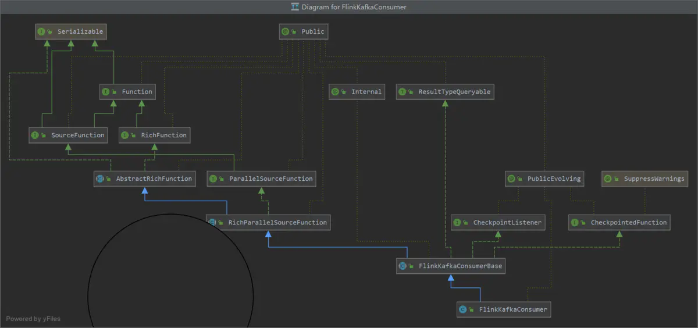

### FlinkKafkaConsumer

FlinkKafkaConsumer是一个流式数据源，用于从Apache Kafka中获取并行数据流。其继承结构如下图所示：

从上图可以看到，FlinkKafkaConsumer继承于FlinkKafkaConsumerBase类，而FlinkKafkaConsumerBase类又实现了RichFunction接口和SourceFunction
接口(在Flink 1.11版本中进行了重构，实现的是ParallelSourceFunction接口)。由于实现了RichFunction接口，所以我们可以分析下其open()方法和run()
方法。

open()方法的实现在FlinkKafkaConsumerBase类中，主要是FlinkKafkaConsumer的初始化逻辑。
首先设置offset的提交模式，OffsetCommitMode是一个枚举类型，有以下三个取值：
  * DISABLED：完全禁用offset的提交;
  * ON_CHECKPOINTS：仅在checkpoint完成时提交offset;
  * KAFKA_PERIODIC：周期性提交，使用kafka客户端内部的自动提交功能;
具体判断OffsetCommitMode的逻辑被封装在OffsetCommitModes.fromConfiguration()方法中，该方法会先判断是否启用checkpoint，如果启用且同时启用
了checkpoint完成时提交offset，则返回ON_CHECKPOINTS；如果未启用checkpoint，同时启用了自动提交则返回KAFKA_PERIODIC，否则在
其他情况下都返回DISABLED。

接着便是创建和启动分区发现工具。createPartitionDiscoverer()方法创建了一个AbstractPartitionDiscoverer类的实例partitionDiscoverer，主要
用于kafka分区的发现，其中的参数topicsDescriptor描述了consumer根据什么样的规则订阅kafka的topic，有两种规则：一种是topic名称的固定列表fixedTopics，
另一种是匹配topic名称的正则表达式topicPattern。partitionDiscoverer.open()方法打开了kafka分区发现，并初始化所有需要的kafka连接。

初始化subscribedPartitionsToStartOffsets已订阅的分区列表，它被初始化为一个hashmap。
partitionDiscoverer.discoverPartitions()方法用于获取所有fixedTopics和匹配topicPattern的topic包含的所有分区信息。

接下来的逻辑分为两个部分，如果consumer是从快照恢复的，则走快照恢复逻辑，否则走直接启动逻辑。
先分析从快照恢复的逻辑，既然是从快照恢复的，那么restoredState肯定不为空，否则就会为空。如果restoredState中没有某个分区的状态，那么将直接从最早
的位点开始消费(这个逻辑是写死的，一定要注意)。
然后对subscribedPartitionsToStartOffsets赋值，它会过滤掉不归该task负责的kafka分区后，将剩余的分区和位点信息放入已订阅的分区列表。此处，注意
计算的方式：先根据分区所属的topic计算hash值，再乘以31，然后按位与0x7FFFFFFF以保证得到的结果是一个质数(按位与是得到正整数最安全的方法，原因可以参看
[Flink扩展阅读5：问题实战](./thinking.md)，里面又详细的介绍和分析)，再将结果用算子的并行度取模，再将得到的结果加上分区所属的分区编号后再次用算子
的并行度取模，得到的值就是将要消费该kafka分区的subtask的编号(这样是为了同一个topic的partition尽量连续地分配给同一个subtask)。然后，判断是否需
要依照分区发现配置的topic正则表达式过滤分区，如果是的话就会过滤掉topic名称不符合topicPattern的分区。

如果consumer不是从快照恢复的，那么restoredState就会为空，consumer就会直接启动，会根据startupMode启动模式走不同的启动逻辑。它也是一个枚举类
型，有五个枚举值：
  * GROUP_OFFSETS：从保存在zookeeper或者是Kafka broker的对应消费者组提交的offset开始消费，这是默认的配置;
  * EARLIEST：尽可能从最早的offset开始消费;
  * LATEST：从最近的offset开始消费;
  * TIMESTAMP：从用户提供的timestamp处开始消费;
  * SPECIFIC_OFFSETS：从用户提供的offset处开始消费。

consumer使用分区发现获取初始分区后，根据StartupMode来设置消费的起始offset。先来看SPECIFIC_OFFSETS的情况，在此种情况下，如果没有配置具体的
消费位点，将会直接抛出异常。否则，获取每个分区指定的消费起始offset，如果该分区设置了消费起始的offset，则从设置的offset开始消费，否则从消费者所
属的消费组的位点开始消费。如果采用TIMESTAMP模式，则会在没有配置消费起始timestamp时抛出异常。否则根据timestamp的值获取到对应的offset，并判断
获取到的offset是否为空，如果不为空就从offset开始消费，否则就从最近的offset开始消费。

再来看run()方法，其实现同样是在FlinkKafkaConsumerBase类中，其主要负责从KafkaConsumer消费数据以及向下游发送数据。具体逻辑是：首先检查在open()
方法中已经初始化和赋值的subscribedPartitionsToStartOffsets是否为null，如果为null则抛出异常，然后设置成功提交位点和失败提交位点的计数器，及获
取子任务的index索引，并注册提交位点时的回调函数，该函数主要是在成功提交位点时将成功的计数器加1，在提交位点失败时将失败的计数器加1。接下来对subscribedPartitionsToStartOffsets
集合进行判断是否为空，如果为空则标记数据源状态为空闲(此时会向下游发送一个最大值的时间戳作为水位线)。在获取数据时，会创建一个KafkaFetcher，它会借助
KafkaConsumer API来从Kafka Broker拉取数据。然后会检测running变量的值，如果不是running状态则会直接返回。最后它会根据配置的分区发现的时间间隔
来确定是否启动分区定时发现任务。如果禁用了分区发现则会直接启动获取数据的任务，否则会调用runWithPartitionDiscovery()方法启动分区发现任务和获取数
据的任务。

runWithPartitionDiscovery()方法比较简单，它会直接调用createAndStartDiscoveryLoop()方法启动分区发现的定时任务，然后启动Kafka Broker数据
获取的任务，然后它会唤醒分区发现任务使得循环能够退出，最后等待分区发现任务执行完毕。createAndStartDiscoveryLoop()方法创建了一个分区发现的线程，
该线程的内部是一个循环，它会尝试发现新的分区，如果方法抛出异常则退出循环。如果数据源已经关闭，或是没有发现新的分区，就没必要再添加新的分区。最后启动
该分区发现的定时任务线程。其中最关键的还是partitionDiscoverer.discoverPartitions()方法，该方法就是发现分区的执行过程，它会首先确保数据源没有
被关闭，也没有被wakeup，然后根据配置来获取分区。如果配置的是fixed topics，则会获取所有这些topic的分区。否则如果配置的是topicPattern则会先获取
所有的topic分区，然后会排除掉那些名字与topicPattern不匹配的topic。如果剩余的匹配的topic数目不为0，则获取这些topic的分区，否则就将新发现的分区
设置为null。如果新发现的分区为null，就配出RuntimeException，否则就对新发现的分区进行循环，将它们存入discoveredPartitions集合，并判断该分区
是否归当前task消费，如果不是就会将其从新发现的分区中移除，最终返回的就是归属于当前task消费的新发现的分区。

runFetchLoop()方法是获取数据的主入口，它通过一个循环来不断获取Kafka Broker的数据。具体逻辑是：Handover负责在KafkaConsumerThread和KafkaFetcher
之间传递数据，然后启动Kafka消费线程，定期从KafkaConsumer拉取数据并转交给handover对象。启动一个循环，该循环从handover中获取数据，如果此时KafkaConsumerThread
暂时尚未将数据转交给handover，则该方法会被阻塞。然后遍历每一个Kafka分区，获取属于该分区的记录，然后将Kafka记录反序列化为bean，如果数据已到流的末
尾则会停止拉取数据，最后调用emitRecord()方法将反序列化后的数据发送出去，更新位点，并生成timestamp和watermark。emitRecord()方法的逻辑非常简单，
它直接调用了emitRecordWithTimestamp()方法。该方法首先判断如果记录不为null，并且不需要发送timestamp和watermark，则在对checkpointLock进行
同步的情况下，调用SourceFunction中SourceContext的collectWithTimestamp()方法将数据发送出去，这个及其后续在[Flink源码阅读16：Flink数据通信](./conn.md)
中已做过细致的分析。如果需要周期性的发送watermark，则会调用emitRecordWithTimestampAndPeriodicWatermark()方法，这个方法会使用extractTimestamp()
方法获取timestamp，然后同样调用SourceContext的collectWithTimestamp()方法将数据发送出去，同时更新分区的位点。如果是PunctuatedWatermark，
则会调用emitRecordWithTimestampAndPunctuatedWatermark()，这个方法会获取timestamp和watermark，它比上一个方法多的就是会获取watermark并
将watermark发送出去，后续逻辑基本一致。否则，如果记录为空，就只更新分区的位点即可。

最后来看下KafkaConsumerThread，它负责在单独的线程中从Kafka中拉取数据到handover。具体逻辑是：如果不是正处于commit的过程中，则获取需要提交的位点
的值，以及位点提交的回调函数，并在获取完毕后设置其为null以防重复提交。如果获取到的不为null，则调用consumer.commitAsync()开启异步提交位点。然后，
由于周期性分区发现功能的存在，需要为consumer指定新发现的分区，否则拉取数据时将会报错。最后从consumer拉取数据，拉取时会指定一个pollTimeout，它的
默认值是100毫秒，可以通过flink.poll-timeout参数进行调整，在这个超时范围内能拉取多少数据就拉取多少数据，最后将数据转交给handover。整个过程大致就
是这样。

最后来分析下checkpoint的大致流程，其主要涉及的是状态的读写，主要分为两步。一是snapshotState过程，代码位于在FlinkKafkaConsumerBase的snapshotState()
方法中，大致逻辑是：如果KafkaFetcher尚未初始化完毕，则需要保存已订阅的topic以及它们的初始位点。否则，调用fetcher的snapshotCurrentState()方法。如果
offsetCommitMode为ON_CHECKPOINTS类型，还需要将topic和offset写入到pendingOffsetsToCommit集合中。该集合用于checkpoint成功的时候向Kafka broker
提交offset。当offsetCommitMode不是ON_CHECKPOINTS和DISABLED的时候，将使用自动提交位点的模式。二是notifyCheckpointComplete过程，当所有的operator
都已经完成快照时，就会向JobManager的CheckpointCoordinator发送确认消息，然后coordinator会通知各个operator checkpoint已经完成。为了保证保证
数据不会被遗漏和重复消费，ON_CHECKPOINTS模式运行的FlinkKafkaConsumer只能在这个时候提交offset到kafka consumer。因此，在notifyCheckpointComplete
时通知Kafka Consumer，将checkpoint时保存的各个分区的位点提交给kafka broker，从而保证了数据的一致性。

