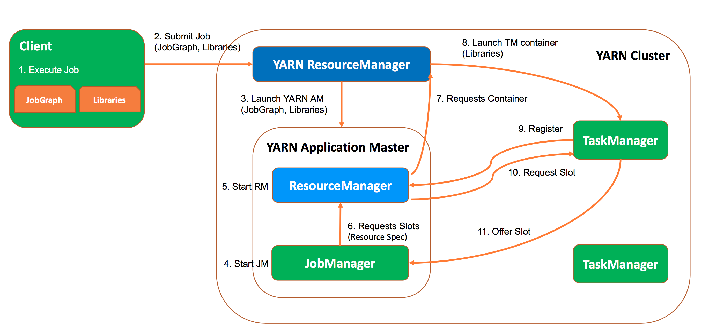

任务提交
-------------

Flink是目前非常火的一款实时流式计算框架，阿里对其的加持也让它在国内成为最受欢迎的流式计算框架，这一方面是由于阿里双十一对其的应用使其经历过
海量实时计算的场景考验，另一方面也表明了阿里在国内技术领域的话语权，另一个比较显著的例子是阿里提出的中台概念被众多的互联网公司借鉴，虽然我
个人觉得除了数据中台等少数几个中台确有意义，其余大部分中台的概念可能都会水土不服，但是Flink这个框架确实有很多值得学习和研究的地方。

额外的插一句话，数据中的目的(或者说所有中台的目的)都是让数据(或其它资源)持续的使用起来，通过中台提供的工具、方法和运行机制，将数据(或其它)
资源变成一种能力，让数据(或其它资源)能更方便的为业务所使用。

回到Flink，它实际上是Google Dataflow模型的一种实现，其设计与Dataflow模型高度贴合，感兴趣的话可以去研究一下Dataflow，对于理解Flink的
设计非常有帮助。目前，Flink为了全面对标Spark从而构建属于自己的生态，加上正在和阿里内部使用的Flink版本也就是Blink进行合并，版本正在进行
着快速的迭代升级，这在给我们不断带来新功能新特性的同时，也给使用它和分析其源码带来了不小的挑战。

但是不管它的组件和代码怎么变，任务的提交不会变，所以这里也就先从任务的提交开始分析。Flink任务在被提交到Yarn上后会经过如下流程,具体如下:

 

 1. Client从客户端代码生成的StreamGraph提取出JobGraph;

 2. 上传JobGraph和对应的jar包;

 3. 启动App Master;

 4. 启动JobManager;

 5. 启动ResourceManager;

 6. JobManager向ResourceManager申请slots;

 7. ResourceManager向Yarn ResourceManager申请Container;

 8. 启动申请到的Container;

 9. 启动的Container作为TaskManager向ResourceManager注册;

 10. ResourceManger向TaskManager请求slot;

 11. TaskManager提供slot给JobManager,让其分配任务执行.

 上面的流程主要包含Client,JobManager,ResourceManager,TaskManager共四个部分.接下来就对每个部分进行详细的分析.

### 生成StreamGraph

在用户编写一个Flink任务之后是怎么样一步步转换成Flink的第一层抽象StreamGraph的呢?本节将会对此进行详细的介绍.

StreamGraph生成的主要流程如下:

 * 用户对DataStream声明的每个操作都会将该操作对应的Transformation添加到Transformations列表:List
 * 用户程序中调用env.execute后(batch调用print方法类似),Flink将从List的Sink开始自底向上进行遍历,这也是为何Flink一定要写Sink的原因,没有Sink就无法生成StreamGraph.
 * 如果上游Transformation还没有进行处理,会先对上游的Transformation进行处理,处理即包装成一个StreamNode,再通过Edge建立上下游StreamNode的联系.
 * StreamGraphGenerator.generate()方法会最终生成一个完整的StreamGraph

 其中,addSink的大致流程为:生成Operator -> 生成Transformation -> 加入Transformations中.具体操作如下:

 (1). 对用户函数进行序列化,并转化成Operator
 (2). clean进行闭包操作,如使用了哪些外部变量,会对所有字段进行遍历,并将它们的引用存储在闭包中
 (3). 完成Operator到SinkTransformation的转换,由DataStream和Operator共同构建一个SinkTransformation
 (4). 将SinkTransformation加入到transformations中

其实Transformation包含许多种类型,除了上面的SinkTransformation,还有SourceTransformation,OneInputTransformation,TwoInputTransformaion,PartitionTransformaion,
SelectTransformation等等.具体的使用场景如下:

 * PartitionTransformation:如果用户想要对DataStream进行keyby操作,得到一个KeyedStream,即需要对数据重新分区.首先,用户需要设置根据什么key进行
   分区,即KeySelector.然后在生成KeyedStream的过程中,会得到一个PartitionTransformation.在PartitionTransformation中会对这条记录通过key进行计算,
   判断应该发往下游哪个节点,KeyGroup可以由maxParallism进行调整.
 * TwoInputTransformaion:指包含两个输入流,如inputStream1和inputStream2,加上这个Transformation的输出,及Operator即可得到一个完整的TwoInputTransformation.

以上过程得到了transformations的List,接下来就可以通过StreamGraphGenerator生成完整的StreamGraph.
生成StreamGraph时会遍历Transformation树,逐个对Transformation进行转化,具体的转化由transform()方法完成.transform最终都会调用transformXXX对
具体的StreamTransformation进行转换.transformPartition则是创建VirtualNode而不是StreamNode.

### Client

Client模块的入口为CliFrontend,用于接收和处理各种命令与请求,如Run和Cancel代表运行和取消任务,CliFrontend在收到对应命令后,根据参数来具体执行命令.
Run命令中必须执行Jar和Class,也可指定SavePoint目录来恢复任务.

Client会根据Jar来提取出Plan,即DataFlow.然后在此Plan的基础上生成JobGraph.其主要操作是对StreamGraph进行优化,将能chain在一起的Operator进行Chain在一起的操作.
在得到JobGraph后就会提交JobGraph等内容,为任务的运行做准备.
Operator能chain在一起的条件:

 1. 上下游Operator的并行度一致

 2. 下游节点的入度为1

 3. 上下游节点都在同一个SlotSharingGroup中(默认为default)

 4. 下游节点的chain策略是ALWAYS(可以与上下游链接,map/flatmap/filter等默认是ALWAYS)

 5. 上游节点的chain策略是ALWAYS或HEAD(只能与下游链接,不能与上游链接,source默认是HEAD)

 6. 两个Operator间的数据分区方式是fowward

 7. 用户没有禁用chain