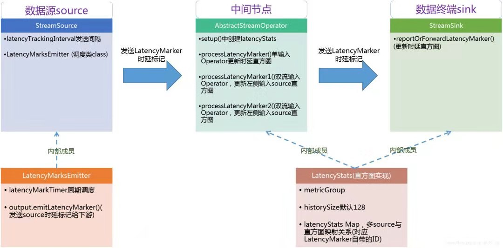

全链路延迟测量
-------------

Flink Job端到端延迟是一个重要的指标，用来衡量Flink任务的整体性能和响应延迟(低延迟)。一些低延时的处理场景，例如用户登录、下单规则检测、实时预测
等，需要一个可度量的Metric指标来实时观测、监控集群全链路时延情况。

我们可以设想，最简单的设计就是在每个记录的source上附加一个摄取时间(ingestion time)时间戳，方案实现简单，但是存在的一个明显问题是：如果某个用户
不需要使用这个延迟监控功能，那这种设计就带来了额外的开销(每个元素+每个元素上的System.currentTimeMilis()需要8个字节)。因此，Flink采用了另外一
种实现方式，即通过定期发送特殊事件(LatencyMarker)的方式来实现此功能，这类似于通过拓扑发送水印watermark。

这个特殊的事件(LatencyMarker)在source上可以配置发送间隔，并由任务Task进行转发。Sink最后接收到LatencyMarks后，将比较LatencyMarker的时间戳
与当前系统时间，以确定延迟。

LatencyMarker不会增加作业的延迟，但是它与常规记录类似，可以被delay阻塞(例如出现背压时)，因此LatencyMarker的延迟与StreamRecord延迟近似，实际
上Flink的上游算子除了会向下游算子传递StreamRecord常规记录外，还会传递WaterMark、StreamStatus、LatencyMarker等同样继承了StreamElement抽象
类的特殊数据类型。

上述建议期望所有的任务管理器TaskManager上的时钟是同步的，否则测量的延迟也包含TaskManager时钟之间的偏移，可以通过JobManager作为计时服务中心来
缓解这个问题，这样TM就可以通过定期查询JM的当前时间，来确定其时钟的偏移量，这个偏移量会包含TM和JM之间的网络延迟，但是已经能较好的测量时延。

LatencyMarker按默认的配置时间间隔从源发出，这个时间间隔默认是0毫秒，即不触发(配置项在ExecutionConfig#latencyTrackingInterval，名称
metrics.latency.interval)，例如可以配置为2000毫秒触发一次LatencyMarker发送。

LatencyMarker不能"多于"常规元素，这确保了测量的延迟接近于常规流元素的端到端延迟，常规操作符Operator(不包括那些参与迭代的Operator)如果不是Sink，
就会转发延迟标记LatencyMarker。

具有多个输出channel的Operator，随机选择一个channel通道，将LatencyMarker发送给它。这可以确保每个LatencyMarker标记在系统中只存在一次，并且重新
分区步骤不会导致传输的LatencyMarker数量激增。