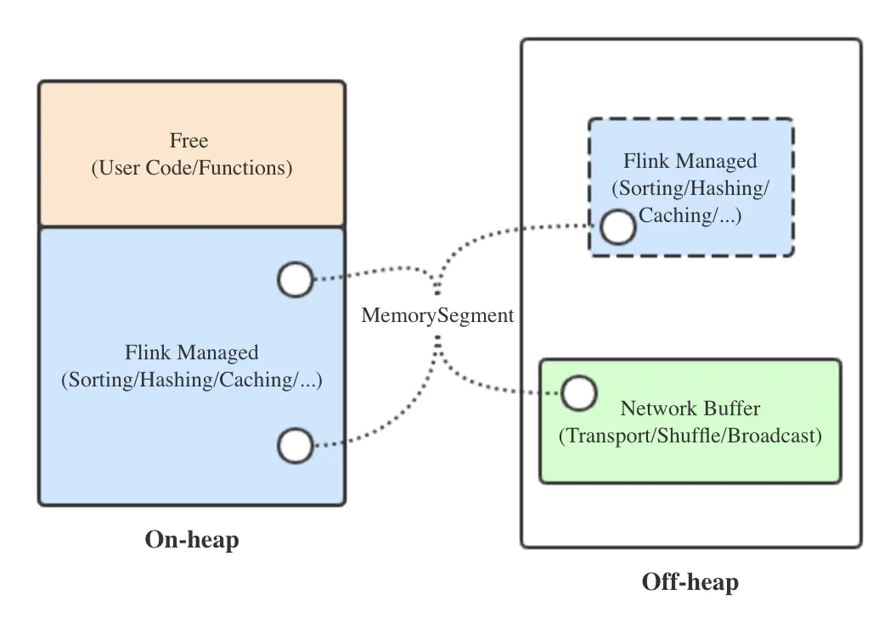
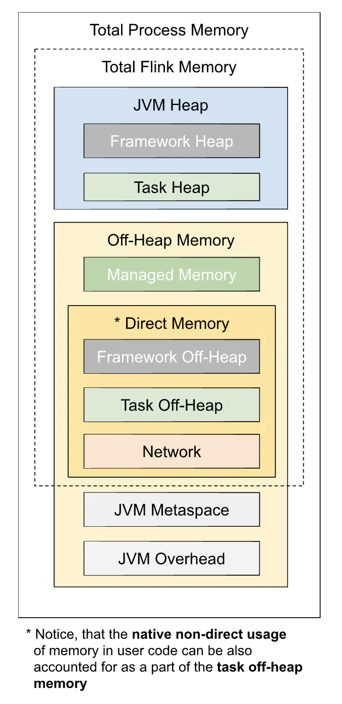

### 内存管理

先来看一下Flink中TaskManager的内存布局：

Flink为了减少对象存储开销，会先将对象进行序列化后再进行存储，序列化存储的最小单位是MemorySegment，底层的实现是数组，大小由taskmanager.memory.segment-size
配置项指定，默认32KB。下面分别进行介绍：
  * 网络缓存(Network Buffer)：用于进行网络传输及网络相关的操作(如shuffle、broadcast等)的内存块，由MemorySegment组成，自Flink 1.5版本开始，网络缓存固定分
  配在堆外，这样可以充分利用零拷贝等技术;

  * 托管内存：用于Flink内部所有算子逻辑的内存分配，及中间数据的存储，同样是由MemorySegment组成，通过Flink的MemoryManager组件进行管理。默认堆内分配，如果开启
  堆外内存分配的开关，也可以在堆外、堆内同时进行分配。相比于Spark，它没有对存储内存和执行内存进行区分，所以也更加的灵活;

  * 空闲内存：实际上用于存储用户代码和数据结构，固定分配在堆内，一般可以认为堆内内存减去托管内存后剩下的就是空闲内存;

YARN部署的per job集群的启动调用的是YarnClusterDescriptor.deployJobCluster()方法，其中的ClusterSpecification对象持有该集群的3个基本参数：JobManager内存
大小、TaskManager内存大小、每个TaskManager的slot数量，deployInternal()方法在其中调用YarnClusterDescriptor.validateClusterResources()方法对资源进行校
验。clusterSpecification.getMasterMemoryMB()返回的是JobManager的内存，默认是768MB，可以通过参数jobmanager.heap.size设置。clusterSpecification.getTaskManagerMemoryMB()
返回的是TaskManager的内存，默认是1024MB，可以通过参数taskmanager.heap.size设置。

以上是Flink1.10版本之前的内存管理方案，其实际上的配置比较复杂，有很多隐藏的细节需要注意，并且对于批处理作业和流处理作业分别有一套不同的配置方法，因此社区一直在探究
并提出了一套新的统一的内存模型和配置，并在Flink 1.10版本中进行了发布。下面就让我们来分析下吧，先来看下新的内存布局：

由上图可以看出，与老版本的内存模型还是有很大的区别的，下面分别进行介绍：
  * Flink总内存：TM所占用的所有与Flink相关的内存，包括位于堆内和堆外的Flink框架内存、位于堆外的托管内存、位于堆外的网络缓存、位于堆内和堆外的任务内存，由参数
  taskmanager.memory.flink.size设置;

  * Flink框架内存：位于堆内和堆外，它是Flink运行时占用的内存，一般不需要调整，由参数taskmanager.memory.framework.heap.size控制堆内部分的大小，参数
  taskmanager.memory.framework.off-heap.size控制堆外部分的大小，它们的默认值都是128MB;

  * 托管内存：仅位于堆外，由MemoryManager进行管理，主要用于缓存中间数据和RocksDB状态后端的数据存储，既可以通过参数taskmanager.memory.managed.fraction
  控制其占Flink总内存的比例来控制其大小(默认0.4)，也可以直接通过参数taskmanager.memory.managed.size直接指定其大小;

  * 网络缓存：仅位于堆外，主要用于TM之间及与外部组件的数据交换，可以通过参数taskmanager.memory.network.fraction控制其占Flink总内存的大小比例，还可以通过参数taskmanager.memory.network.min
  和taskmanager.memory.network.max控制其大小上下限，以免分配得过多或过少;

  * 任务内存：位于堆外和堆外，被用户代码和自定义数据结构所使用，堆内部分通过参数taskmanager.memory.task.heap.size设置，堆外部分通过参数taskmanager.memory.task.off-heap.size设置;

  * TaskManager总内存：它是Flink总内存、JVM元空间与JVM额外内存大小之和，也就是容器本身的内存大小，由参数taskmanager.memory.process.size设置;

  * JVM元空间：也就是JDK1.8以前的HotSpot JVM的方法区，或者叫做永久代，由参数taskmanager.memory.jvm-metaspace.size设置;

  * JVM额外开销：预留的其他本地内存，主要用于线程栈、代码缓存等，避免出现异常;

