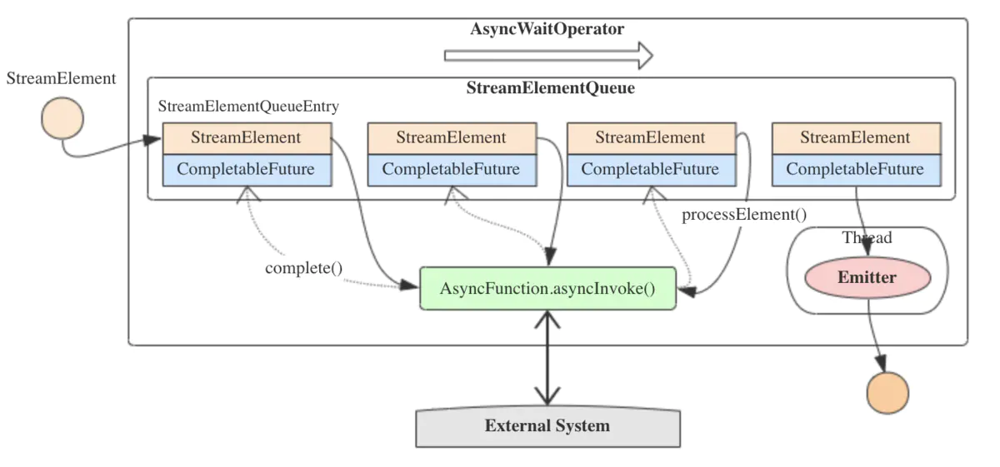

### IO模型及NIO、AIO

我们知道在Unix网络编程中的五种IO模型，它们分别是：
  * 阻塞IO(BIO)

  * 非阻塞IO(NIO)

  * IO多路复用(IO multiplexing)

  * 信号驱动IO(signal driven IO)

  * 异步IO(asynchronous IO)

但是实际上除了AIO外，其余的都是同步IO(同步IO不一定是阻塞IO)，之所以称它们是同步IO，是因为在读写事件就绪后它们都需要自己负责进行读写，也就是
说整个读写过程是阻塞的。由于在实际生活中，信号驱动IO非常少用到，所以主要介绍其余的四种。

先来看一下IO的过程，对于一个网络IO，主要涉及两个交互，一是应用调用IO进程，等待数据准备完成；二是数据准备好并从内核态拷贝到用户进程中。

在阻塞IO的场景下，每一个步骤都是阻塞的，所以如果应用程序调用了IO进程，内核就必须开始准备数据，如果此时数据还没有完全到来，那么内核就必须先等待
数据全部到达。在数据完全到来后，将数据从内核态拷贝到用户态，内核返回并处理其它请求，应用程序从阻塞状态恢复并重新运行。纵观整个过程，我们发现在
IO的两个阶段都被阻塞了。

双阻塞明显不是一个好的设计，它的效率极端低下，实际上在应用程序发起IO调用后，如果内核中的数据还没有准备好，此时并不需要阻塞用户进程，二是可以直
接返回一个未就绪的状态。然后每隔一段时间就再发起一次IO调用，什么时候内核中的数据准备就绪了，此时再收到应用程序的IO调用时就能立马将数据从内核态
拷贝到用户态。此时，用户程序并没有因为数据未就绪而阻塞，在这个过程中它能干一些其它的事情，这就是非阻塞IO。

非阻塞IO的性能相比于阻塞IO已经提升了很多，但是它仍然需要每个应用程序都去定时去发起IO调用检测内核中的数据是否就绪，实际上我们可以用一个代理来实
现同样的功能，并且这个代理不仅可以处理某个应用程序的请求，而是可以处理多个应用程序的IO请求，其中任意一个数据就绪了就通知应用程序处理，这明显的解
放了应用程序的性能。这就是所谓的IO多路复用，有三种不同的实现方式(这些都是Unix系统所支持的)：
  * select：最早期的实现，它的缺点是需要无差别的轮询所有等待在其上的流，从而找出能读出数据或写入数据的流，因此其时间复杂度为O(n);

  * poll：本质上与select没啥区别，优点在于解决了select原有的单进程可监视的fd的数量限制，采用链表的方式，所以没有最大连接数限制;

  * epoll：其有EPOLLLT和EPOLLET两种触发模式，LT是默认的模式。在LT模式下只要fd还有数据可读，每次epoll_wait都会返回它的事件，提醒用户程序去
  操作，而ET模式中只会提示一次，直到下次再有数据流入之前都不会再提示;

最后介绍异步IO，其与上面介绍的几种方式都不太一样。它的读取操作会通知内核进行读取操作并将数据拷贝至进程中，完成后通知进程整个操作全部完成，而读取
操作会立刻返回，应用可以进行其它的操作，而所有的数据读取、拷贝工作全部都由内核去做，完成后通知进程，进程调用绑定的回调函数来处理数据。

总结一下这些不同类型的IO操作：
  * 阻塞IO：调用后一直等待远程数据就绪再返回，直到读取结束;

  * 非阻塞IO：无论在什么情况下都会立即返回，不会被阻塞，但是它仍要求进程不断地去主动询问内核是否准备好数据，也需要进程主动地再次调用读取方法来将
  数据拷贝到用户内存;

  * 同步IO：一直阻塞进程，直到I/O操作结束，BIO、NIO、IO多路复用、信号驱动IO都是同步IO;

  * 异步IO：不会阻塞调用者，而是在完成后通过回调函数通知应用数据拷贝结束;

Flink从1.2版本开始引入了异步IO机制，专门用于解决Flink计算过程中与外部系统的交互，它提供了一个能够异步请求外部系统的客户端，也就是AsyncWaitOperator，
由AsyncDataStream.addOperator()/orderedWait()/unorderedWait()产生，是异步IO的核心。在其构造函数中传入了AsyncFunction类，这是个执行异步操作
的类，用户需要覆写其asyncInvoke()方法实现异步操作完成后的逻辑。StreamElementQueue是一个包含StreamElementQueueEntry的队列，底层实现是ArrayDeque，
也就是数组实现的双端队列。StreamElementQueueEntry是对StreamElement的简单封装，而StreamElement则是Flink中的基础概念，它可以是Watermark、
StreamStatus、Record或LatencyMarker等的简单封装(简单的说，就是Flink中流动的流数据的类型的简单封装)，通过CompletableFuture实现了异步的返回。可以
通过一张图来进行一下简单的了解：

从上图可以看出，上游的StreamElement进入AsyncWaitOperator的StreamElementQueue，并被封装为StreamElementQueueEntry的实例，然后AsyncWaitOperator
会调用传入的AsyncFunction的asyncInvoke()方法，这个方法与外部系统进行异步的交互。在异步操作完成后，asyncInvoke()方法会调用ResultFuture.complete()
方法将结果返回(ResultFuture就是CompletableFuture的代理接口)，如果出现异常则会调用completeExceptionally()方法处理。从队列中移除未完成队列的元素，添
加元素到已完成队列，然后将已完成队列中的元素通过TimestampedCollector发送出去。

AsyncDataStream.orderedWait()/unorderedWait()的输出是需要考虑顺序性的，如果调用的是orderedWait()方法，则会创建OrderedStreamElementQueue队列，
保持请求的顺序与输出结果的顺序一致，也就是先进先出；如果是采用unorderedWait()方法，则创建的是UnorderedStreamElementQueue队列，不保证顺序。如果使用
的是处理时间则先返回的结果会先输出，而采用事件时间时，还是需要额外保证水印的边界不错乱。
  * 有序是最简单的情况，只需要将元素按照到来的顺序放入OrderedStreamElementQueue，只有当队列中的队头请求异步操作返回了结果，才会触发输出，后面的请求先
  返回也只能等待;

  * 处理时间的无序也不太复杂，它是在UnorderedStreamElementQueue中维护两个子队列，一个是未完成请求的队列，一个是已完成请求的队列，所有请求都先进入
  未完成请求的队列中并执行异步操作，并按照操作完成的顺序进到已完成队列中，再从已完成队列中拉取并输出结果即可;

  * 事件时间的无序是比较复杂的一种情况，它允许两个水印之间的元素乱序，但是水印不能乱序，因此在使用两个队列的同时，未完成队列中还必须存储水印，这就是上面的
  WatermarkQueueEntry的由来。在水印之间存储的也不再是单个StreamElementQueueEntry，而是它们的集合。只有当未完成队列中的队头集合中有元素的异步操作返回
  时才能将其移动到已完成队列里面。这样就可以保证在通过某个水印之前，它前面的所有异步请求都完成。

异步I/O的检查点实现比较简单，由于StreamElementQueue保存的就是尚未完成异步请求的元素，以及已完成异步请求但还没有发送的元素，只要遍历该队列，并将它们都放入
状态后端就算完成。

好啦，终于以Flink中的异步IO为例讲完了AIO的实例！

额外说一下，实际工作中由于Linux中的AIO并不完善，所以在Linux下的IO模型更多的是以NIO为主。比如常见的使用IO多路复用技术结合线程池来实现的高并发，这也是常说
的Reactor，如我们工作中经常遇到的Redis(单Reactor单进程模式)、Nginx(单Reactor多进程)、Netty(多Reactor多线程模式)等。C语言编写的系统更喜欢使用进程模
式(单Reactor下更是如此)，而Java及其它的JVM语言更喜欢使用线程模式，因为JVM本身就是一个进程，JVM中有很多线程，业务线程只是其中的一个而已。

关于IO模型的介绍到此就结束了。

今天是清明节，愿在抗击疫情中牺牲的烈士和逝世的同胞在天之灵能够安息！阿门！！！