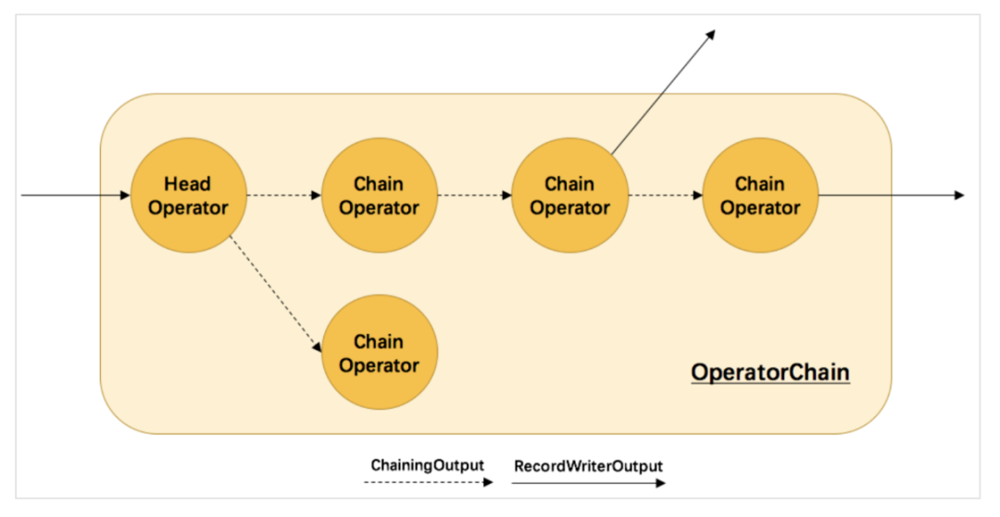

### Operator Chain

Operator Chain是指将满足一定条件的Operator链在一起，放在同一个Task(也就是线程)中执行，它是Flink任务优化的一种方式。由于所有chain在一起的sub-task
都会在同一个线程(也就是TM的slot)中运行，所以在同一个Task里面的Operator的数据传输就从网络传输变成了函数调用，这大大的减少了数据传输的过程，减少了
不必要的数据交换、序列化反序列化的开销以及线程的上下文切换，提升了作业的执行效率。常见的chain，如source->map->filter->sink，这样的任务可以链在一
起，其是在优化逻辑执行计划的阶段加入的，也就是发生在由StreamGraph生成JobGraph的过程中。那么既然是要满足一定的条件才能chain在一起，那么究竟要满足
什么样的条件呢，以及chain在一起后如何执行呢？

前面在分析任务提交时其实已经分析过chain在一起需要满足的条件了，为了加深印象，我们再来分析一下。
我们知道，在Flink中有四种图，分别是StreamGraph、JobGraph、ExecutionGraph和物理执行图。其中，前两种是在客户端生成，而ExecutionGraph是在JobMaster中
生成，最后一种物理执行图是一个虚拟的图，它并不存在相对应的数据结构，它只是运行在每一个TaskManager的一种抽象。

由于Flink当前对于流处理的程序是不作优化的，所以我们在Flink程序中通过System.out.println(env.getExecutionPlan())打印出来的Flink执行计划其实就是
StreamGraph。而我们在Flink Web UI中看到的图就是JobGraph。JobGraph相对于StreamGraph，其实就是进行了优化，优化就是将能够chain在一起的Operator
chain在一起，这个chain的过程在客户端生成JobGraph的过程中完成。具体的实现代码在StreamingJobGraphGenerator中，其核心方法是createJobGraph()，该方
法会首先计算出StreamGraph中各个节点的hashcode作为唯一标识，并创建一个空的Map结构保存需要被chain在一起的算子的hashcode。然后调用setChaining()方法，
这个方法的实现很简单，就是逐个遍历StreamGraph中的source节点，并调用createChain()方法。createChain()方法是创建operator chain的核心方法，其中定义
了三个List结构：
  * transitiveOutEdges：当前算子在JobGraph中的出边列表，同时它也是createChain()方法最终返回的值;
  * chainableOutputs：当前能够chain在一起的StreamGraph边列表;
  * nonChainableOutputs：当前不能chain在一起的StreamGraph边列表;
  
然后，就会从source节点开始遍历StreamGraph中当前节点的所有出边，调用isChainable()方法来判断是否可以被chain在一起，如果可以则被放入chainableOutputs
列表，否则就放入nonChainableOutputs列表。对于chainableOutputs中的边，会以这边边的直接下游作为起点，继续递归调用createChain()方法延展算子链。而对于
nonChainableOutputs中的边，由于当前算子链已经到达尽头，所以就会以这些"断点"作为起点，继续递归调用createChain()方法试图创建新的算子链。这也就是说，逻辑
计划中整个创建算子链的过程是递归的，实际返回时是从sink端开始返回的。随后判断当前节点是否是算子链的起始节点，如果是则调用createJobVertex()方法来为算子链创
建一个JobVertex(也就是JobGraph中的起点)，最终形成JobGraph。需要注意的是，还需要将各个节点的算子链数据写入各自的StreamConfig中，算子链的起始节点还需要
额外保存transitiveOutEdges。

isChainable()方法中描述了上下游算子chain在一起的条件，包括：
  * 上下游算子实例处于同一个SlotSharingGroup中;
  * 下游算子的链接策略为ALWAYS;
  * 上游算子的链接策略为HEAD或ALWAYS;
  * 两个算子之间的流分区逻辑是ForwardPartitioner;
  * 两个算子间的shuffle方式不是批处理模式;
  * 上下游算子实例的并行度相同;
  * 没有禁用算子链;
  
 所有的StreamTask都会创建OperatorChain，如果一个算子无法进入算子链，也会形成一个只有headOperator的单个算子的OperatorChain。
 
 在OperatorChain的构造方法中，首先会遍历算子链整体的所有出边，调用createStreamOutput()方法创建对应的下游输出RecordWriterOutput。然后调用
 createOutputCollector()方法创建物理的算子链，并返回chainEntryPoint(流入算子链的起始Output)，这个方法从前面写入的StreamConfig中分别取出
 出边和链接边的数据，并创建各自的output，出边的output就是将数据发往算子链之外下游的RecordWriterOutput，而链接边的输出则需要依靠createChainedOperator()
 方法。createChainedOperator()方法递归调用了createOutputCollector()方法，不断延伸output来产生chainedOperator(即算子链中除了headOperator
 之外的算子)，并逆序返回(所以allOperators数组中的算子顺序为倒序)。chainedOperator产生后，将它们通过ChainingOutput连接起来，最终形成如下图
 的结构：
 

ChainingOutput.collect()方法输出数据流的方式非常简单，它通过调用链接算子的processElement()方法，直接将数据推给下游进行处理。这也就是说，
OperatorChain完全可以视作是一个由headOperator和streamOutputs组成的单个算子，其内部的chainedOperator和ChainingOutput都被黑盒所遮蔽，同
时也没有引入任何overhead。
