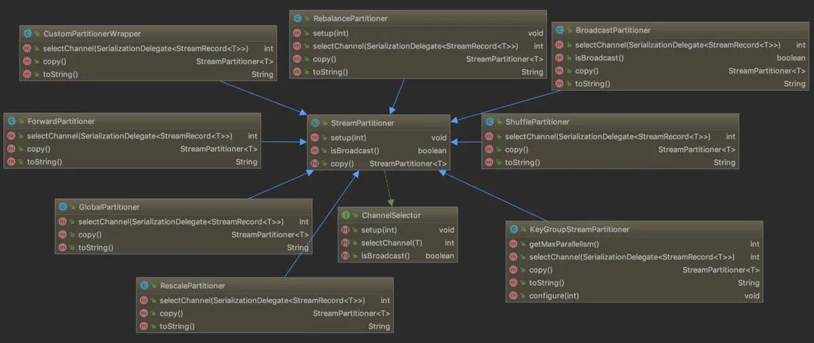

### 分区器Partitioner

在Flink中通过流分区器StreamPartitioner来控制DataStream中的元素流向下游算子的哪些分区中，其类图如下所示：

StreamPartitioner继承自ChannelSelector接口，这个channel表示的是下游算子的并发实例(也即物理分区)，除BroadcastPartitioner外的所有StreamPartitioner
的子类都要实现selectChannel()方法，用于选择逻辑分区号。下面分别来看一下Flink提供的分区器：
  * BinaryHashPartitioner：用于BinaryRow的hash分区器，它先使用通用的Hash函数，然后使用MurmurHash对传入的记录计算哈希值，再按总分区数取模
  来得到下游算子的分区号;

  * BroadcastPartitioner：流广播专用的分区器，它总是会将数据输出到下游算子的所有并发中去，所以并没有任何实现;

  * CustomPartitionerWrapper：自定义的分区逻辑，可以用过继承Partitioner接口自己实现其中的partition()方法，并将其传给partitionCustorm()
  方法;

  * GlobalPartitioner：类似于Storm中的全局分组，它也只会将数据输出到下游算子的第一个实例，非常的简单;

  * ForwardPartitioner：其实现与GlobalPartitioner类相同，它将数据数据输出到本地运行的下游算子的第一个实例，而不是全局的第一个实例，如果上下
  游算子的并行度相同，默认采用ForwardPartitioner，否则默认采用RebalancePartitioner;

  * KeyGroupStreamPartitioner：keyBy()算子底层所采用的流分区器，逻辑是先从记录上提取出key的值，然后在key值的基础上经过了两重哈希得到key
  对应的哈希值，第一重是Java自带的hashCode()，第二重则是MurmurHash。然后将哈希值乘以算子并行度，并除以最大并行度，得到最终的分区ID;

  * RebalancePartitioner：先随机选择一个下游算子的实例，然后使用轮询的方式从该实例开始循环输出，该方式能保证完全的下游负载均衡，所以常用于
  处理有倾斜的原数据流;

  * RescalePartitioner：看代码实现有点类似于上面介绍的RebalancePartitioner，实则不然，从StreamingJobGraphGenerator类的connect()方法
  里可以看到，如果分区逻辑是RescalePartitioner或ForwardPartitioner，那么采用的分布式模式是POINTWISE模式连接上下游顶点，而对于其它模式是
  ALL_TO_ALL模式连接。前者在中间结果传递给下游节点时会根据并行度比值来轮询分配给下游算子实例的子集，且会优先选择本地算子；而后者则是真正的全局轮询
  分配，结果更加均衡但会产生节点间数据交换的开销;

  * ShufflePartitioner：非常之简单，就是将数据随机输出到下游算子的并发实例中;