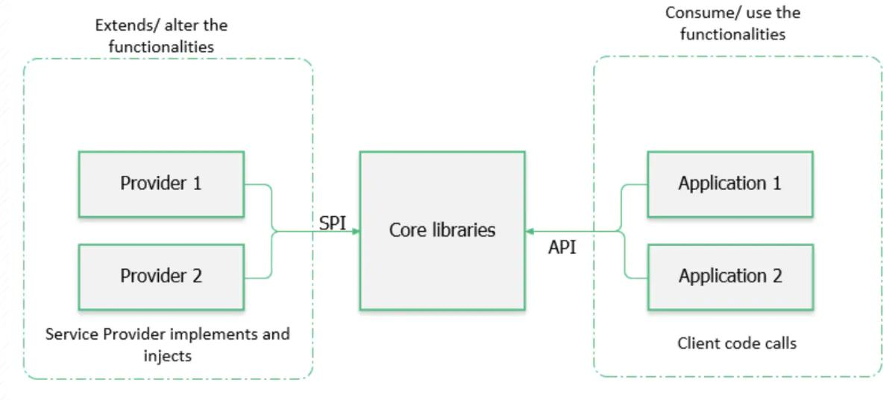

### Java SPI

API是站在应用的角度定义了功能如何实现，SPI是系统为第三方专门开发的扩展规范以及动态加载扩展点的机制。下图反映了API和SPI之间的不同：

当作为服务提供方利用SPI机制时，需要遵循SPI的约定：
  * 先编写好服务接口的实现类，即服务提供类;
  * 在classpath的META-INF/services目录下创建一个以接口全限定名命名的UTF-8文本文件，并在该文件中写入实现类的全限定名(多个实现类以换行符分隔);
  * 调用JDK中的java.util.ServiceLoader组件中的load()方法，根据上述文件发现并加载具体的服务实现;
  
LazyIterator是一个懒加载服务提供类的迭代器(ServiceLoader本身也实现了Iterable接口)，维护在lookupIterator中。在实际应用中，我们需要调用
ServiceLoader#iterator()方法获取加载到的服务提供类的结果，它返回一个标准的迭代器，先从缓存的providers容器中获取，如果获取不到再通过lookupIterator
进行懒加载。

内部类LazyIterator的hasNextService()方法负责在上述SPI定义文件中逐个寻找对应的服务提供类并加载资源，而nextService()方法则通过反射创建服务提
供类的实例并缓存下来，直到完成整个发现与注入的流程，所以是懒加载的。由此也可得知，SPI机制内部一定会遍历所有的扩展点并将它们全部加载(这也是其主要缺点)。

下面以JDBC和Flink为例来分析SPI的实际应用。

JDBC为用户通过Java访问数据库提供了统一的接口，而数据库的类型多种多样，并且其类型还会不断的增加，因此借助于SPI机制可以灵活的实现数据库驱动的插件化。
在使用旧版JDBC时，必须首先通过调用类似Class.forName("com.mysql.jdbc.Driver")方法，通过手动的方式来加载数据库驱动。