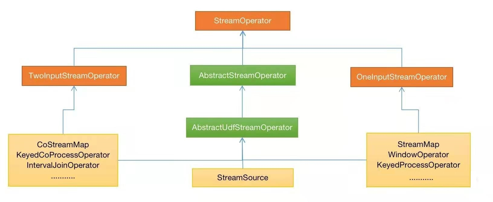

StreamOperator
-------------

StreamOperator是Stream operators的基础接口，是任务执行过程中的实际处理类，其上层由StreamTask调用，下层调用用户所实现的具体方法，它的
实现类是实现OneInputStreamOperator或TwoInputStreamOperator接口中的一种，分别表示处理一个输入、两个输入的Operator，其中包含了
processElement/processWatermark/processLatencyMarker方法，并用来创建算子处理数据。OneInputStreamOperator实现类StreamMap、
WindowOperator、KeyedProcessOperator等单流入处理Operator，TwoInputStreamOperator实现类CoStreamMap、KeyedCoProcessOperator、
IntervalJoinOperator等多流处理Operator。StreamSource表示的source端的operator，既没有实现OneInputStreamOperator接口也没有实现
TwoInputStreamOperator接口，其就是流处理的源头，不需要接受输入。AbstractStreamOperator是StreamOperator的基础抽象实现类，所有的
operator都必须继承该抽象类，它为生命周期和属性方法提供了默认的实现。AbstractUdfStreamOperator是继承AbstractStreamOperator的抽象实
现类，其内部包含了userFunction，在Task的生命周期都会调用userFunction中对应的方法。

其层级结构如下图：

 

列举一些常见的StreamOperator：
 * env.addSource对应StreamSource;
 * dataStream.map对应StreamMap;
 * dataStream.window对应WindowOperator;
 * dataStream.addSink对应StreamSink;
 * dataStream.keyBy(...).process对应KeyedProcessOperator;

StreamOperator继承的接口有：
 * CheckpointListener接口，其中的notifyCheckpointComplete方法表示checkpoint完成后的回掉函数;
 * KeyContext接口，用于当前key的切换，用于KeyedStream中state的key的设置;
 * Disposable接口，dispose方法主要用于对象销毁和资源释放
 * Serializable序列化接口

前面提到，AbstractStreamOperator是StreamOperator的基础抽象实现类，而AbstractUdfStreamOperator则是面向userFunction调用，接下来就
具体分析一下。它们用于初始化或者资源的释放等操作，大部分方法都是被StreamTask触发调用，从invoke方法作为入口分析：
