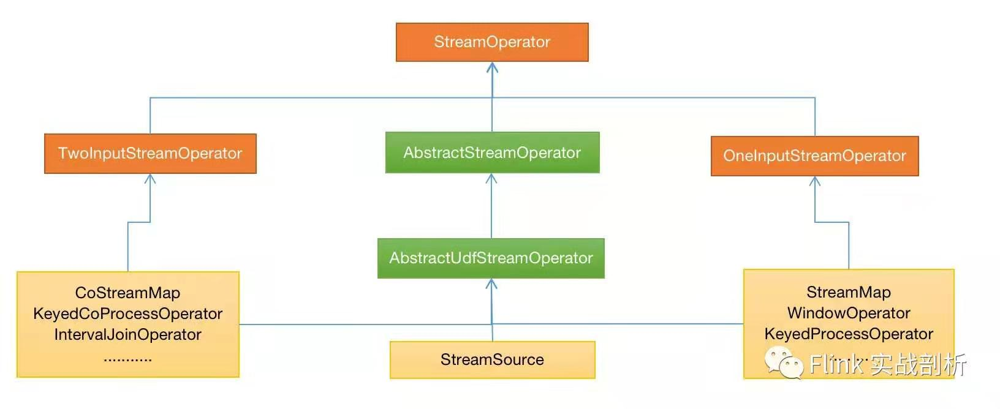

StreamOperator
-------------

StreamOperator是流式operators的基础接口，是任务执行过程中的实际处理类，其上层由StreamTask调用，下层调用用户所实现的具体方法，它的
实现类在创建算子处理数据时是实现OneInputStreamOperator或TwoInputStreamOperator接口中的一种，分别表示处理一个输入、两个输入的Operator，
在这两个接口中包含了processElement/processWatermark/processLatencyMarker方法。

OneInputStreamOperator实现类StreamMap、WindowOperator、KeyedProcessOperator等单流处理Operator，TwoInputStreamOperator实现
类CoStreamMap、KeyedCoProcessOperator、IntervalJoinOperator等多流处理Operator。StreamSource表示的source端的operator，既没有
实现OneInputStreamOperator接口也没有实现TwoInputStreamOperator接口，因为其就是流处理的源头，不需要接受输入。

AbstractStreamOperator是StreamOperator的基础抽象实现类，所有的operator都必须继承该抽象类，它为生命周期和属性方法提供了默认的实现。
AbstractUdfStreamOperator是继承AbstractStreamOperator的抽象实现类，其内部包含了userFunction，在Task的生命周期都会调用userFunction中
对应的方法。

StreamOperator层级结构如下图：

 

StreamOperator继承的接口有：
 * CheckpointListener接口，其中的notifyCheckpointComplete方法表示checkpoint完成后的回调函数;
 * KeyContext接口，当前key的切换，用于KeyedStream中state的key的设置;
 * Disposable接口，其中的dispose方法主要用于对象销毁和资源释放
 * Serializable序列化接口

 列举一些常见的StreamOperator：
  * env.addSource对应StreamSource;
  * dataStream.map对应StreamMap;
  * dataStream.window对应WindowOperator;
  * dataStream.addSink对应StreamSink;
  * dataStream.keyBy(...).process对应KeyedProcessOperator;

AbstractStreamOperator和AbstractUdfStreamOperator
-------------

前面提到，AbstractStreamOperator是StreamOperator的基础抽象实现类，而AbstractUdfStreamOperator则是面向userFunction调用，接下来就
具体分析一下。它们用于初始化或者资源的释放等操作，其中大部分方法都是被StreamTask触发调用，从invoke方法作为入口分析：

 1. initializeState状态初始化，会调用到StreamOperator的initializeState方法，初始化operatorStateBackend和keyedStateBackend状态后端，
 定时器恢复初始化，对于keyedState来说会自动初始化恢复，但是operatorState则需要手动初始化恢复，所以在其继承的AbstractUdfStreamOperator会
 调用userFunction的initializedState方法，前提条件是该userFunction必须实现CheckpointedFunction接口;

 2. open初始化方法，在AbstractStreamOperator中是一个空实现，通常可以在userFunction重写open方法完成一些用户初始化工作;

 3. run方法(最新版本中是mailboxProcessor.runMailboxLoop()方法)，如果任务正常则一直会执行这个方法，根据收到的的不同数据类型调用AbstractStreamOperator的不同方法:

   * 如果是watermark，会调用其processWatermark方法，做一些定时触发的判断与调用;

   * 如果是LatencyMarker，表示的是一个延时标记，用于统计数据从source到下游operator的耗时，会调用processLatencyMarker方法，上报Histogram
   类型的metric，默认关闭;

   * 如果是StreamRecord，也就是需要处理的业务数据，首先会调用setKeyContextElement方法，用于切换KeyedStream类型的statebackend的当前key，
   然后调用processElement具体的数据处理流程;

   * 如果是CheckpointBarrier，表示的是需要进行checkpoint，首先会调用prepareSnapshotPreBarrier方法。在AbstractStreamOperator中是一个
   空的实现，然后调用snapshotState方法。在AbstractUdfStreamOperator中会调用userFunction的snapshotState方法，前提是该userFunction必须
   实现CheckpointedFunction接口;

 4. close方法，任务正常结束调用的方法，在AbstractStreamOperator中是一个空的实现，通常可以在userFunction中重写close方法完成一些资源的
   释放;

 5. dispose方法，任务正常结束或异常结束调用的方法，异常结束时会调用close方法，正常结束不会重复调用close方法，在其中完成一些状态最终资源的
   释放;

其它方法:

 6. setup方法，初始化做一些参数的配置;

 7. notifyCheckpointComplete方法，在checkpoint完成时调用的方法，面向用户实现的userFunction需要实现CheckpointListener接口.
